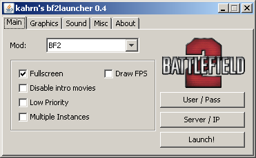
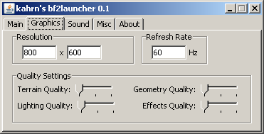

# BF2 Launcher

BF2 Launcher was a program to configure Battlefield 2 and various modifications (such as Project Reality) before they are run.

This project is no longer actively maintained, but is available for archival purposes.

Utilizing BF2 Launcher is it possible and easy to do all of the following before loading BF2:

- Disable introduction movies
- Automatically login and/or join server
- Use lower priority process
- Fullscreen / Windowed
- Multiple Instances
- Support for BF2, BF2_r.exe (debug build), BF2:SF and Project Reality
- Supports debug options for BF2_r.exe (debug build)
- Display FPS in game
- Configure resolution / refresh rate
- Configure graphics quality
- Configure sound (disable sound, enable EAX, enable voip)

# Screenshots




# Instructions

If you have downloaded the precompiled version, you can simply execute the javabf2launcher.jar file:

```java -jar javabf2launcher.jar```

## Build Instructions

For building the project, you will need to ensure you have swing-layout installed as a dependency.

## Author
Ricky Hewitt <ricky@rickyhewitt.dev>